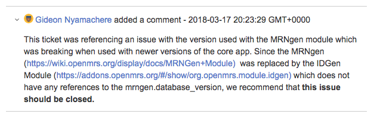
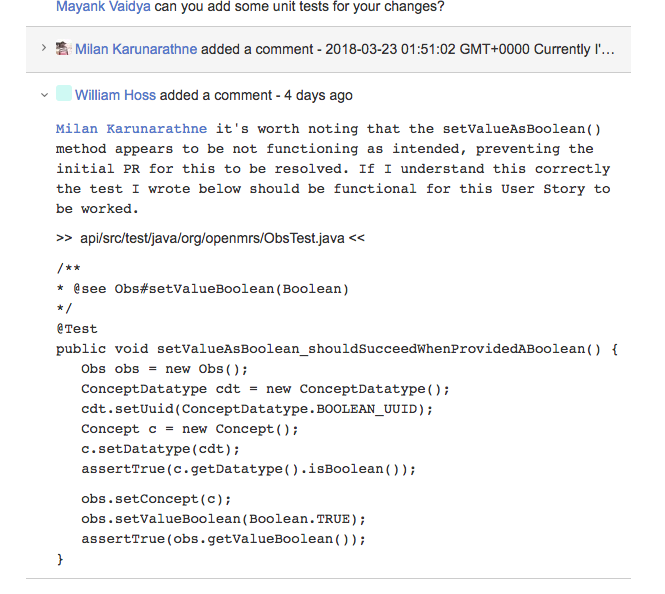

# Introduction

This document describes and links to the user stories from OpenMRS that the OpenFOSS team comprising of the following individuals worked on:

* William Hause
* Jonathan Grant
* Said Robley
* Gideon Nyamachere

# Executive Summary

This document contains the product deliverables from the OpenFOSS team throughout their senior CS4260 cource. This aims to demonstrate the value added from each of these contributions as well as provide the context and content required for someone to continue development with the contributions provided. The OpenFOSS team worked to provide value in the form of backlog grooming and code contributions to the OpenMRS product. OpenMRS exists to build an open source medical record system platform.

# Contributions

## Code Contribution #1 STAND-79
### Description

The OpenMRS platform has a all-inclusive installation option they call their OpenMRS-Standalone product. The installation instructions for this service appeared to have an error regarding the default login credentials for the webapp. This was reported in two user stories within the OpenMRS backlog STAND-79 and STAND-54. Our team's pull request made updated the documentation to match the code in production.

### Links
* [Pull Request](Code-Contributions/STAND-79/Pull_Request/32.html)
* [git diff](Code-Contributions/STAND-79/STAND-79.txt)
* [OpenMRS User Story](Code-Contributions/STAND-79/Jira_Ticket/STAND-79.htm)

** the raw git diff exists at the bottom of this document under ** [*Code Contribution #1 STAND-79*](#STAND-79)

## Code Contribution #2 TRUNK-3401
### Description
TRUNK-3401 is an OpenMRS backlog issue that addresses a bug that was discovered in OpenMRS version 1.9. If a call is made to encounter.setProvider(User) method in api/src/main/java/org/openmrs/api/impl/ProviderServiceImpl.java and the User does not have a Provider object associated, it throws an error. Though the current version at the time of writing this note was 2.1, the OpenMRS community wanted this method fixed to provide backwards-compatibility and support for modules that use this method.
The specifications stated the following requirements to fix the bug:
1.	Create a convenience method in ProviderServiceImp.java class that takes a user and creates a Provider for them.
2.	Create a Provider record object for the User if the Provider is not already assigned to this User.
3.	An exception should be thrown if the Provider Object could not be created for the user.

OpenFOSS team added value to OpenMRS by making the following changes to satisfy the requirements:

* We added a method to the interface to ensure that the method is always implemented by any inheriting classes. 
* We added some tests to ensure that we got the desired outcome which also increased the test coverage.
* Then created a method to allow a user to be assigned a Provider object if none is already assigned and if the Provider is already assigned, it will return the Provider. 

We made a number of GitHub pull requests for this issue, and the OpenMRS developer community responded with a number of recommendations that are reflected in the current pull request. Some changes included, the addition of logging as well as the message to be logged, and the order of the if/else checks in the method.
This information is important to ensure that any new changes made for this issue do not regress the code and intent. 

### Links
* [Pull Request](Code-Contributions/TRUNK-3401/Pull_Request/2625.html)
* [git diff](Code-Contributions/TRUNK-3401/TRUNK-3401.txt)
* [OpenMRS User Story](Code-Contributions/TRUNK-3401/Jira_Ticket/TRUNK-3401.htm)

** the raw git diff exists at the bottom of this document under ** [*Code Contribution #2 TRUNK-3401*](#TRUNK-3401)

## Code Contribution #3 TRUNK-5331
### Description
OpenMRS is a medical record system and its users occasionally need to intersect large collections of patients to find common traits among them. OpenMRS’ extant intersection function did not produce a true intersection, so we refactored the function and corrected its behavior. For more details about the requirements, you can view OpenMRS’ JIRA issue, [TRUNK-5331](Code-Contributions/TRUNK-5331/Jira_Ticket/[#TRUNK-5331]

This contribution added 46 lines of code to the product; it added one new test (29 lines) and refactored one function (17 lines). This contribution represents 20 hours of effort, and you may view the exact changes we made in [git diff](Code-Contributions/TRUNK-5331/TRUNK-5331.txt)

OpenMRS’ automated code review of this contribution, which can be found in this [Pull Request](Code-Contributions/TRUNK-5331/Pull_Request/2649.html), showed that we met all of their quality standards, which included (but were not limited to):
*Passing integration testing
*Increasing the product’s overall code coverage
*Adhering to style conventions.

Additionally, to address the needs of our code’s maintainers, we created a UML activity diagram (consider adding link) depicting the intended behavior of the function.

### Links
* [Pull Request](Code-Contributions/TRUNK-5331/Pull_Request/2649.html)
* [git diff](Code-Contributions/TRUNK-5331/TRUNK-5331.txt)
* [OpenMRS User Story](Code-Contributions/TRUNK-5331/Jira_Ticket/TRUNK-5331.htm)

** the raw git diff exists at the bottom of this document under ** [*Code Contribution #3 TRUNK-5331*](#TRUNK-5331)

## Code Contribution #4 TRUNK-5382
### Description
The method getSetmembers() returns all members which includes both retired and unretired members, and it does not have an option to exclude retired members, so in order to enhance the user experience OpenFoss has claimed this issue and made an attempt to add this feature.  We have added a method called getSetMembers(Boolean includeRetired)  if the parameter is set to true the method returns the same as getSEtMembers() otherwise returns all set members excluding retired members.

### Links
* [Pull Request](Code-Contributions/TRUNK-5382/Pull_Request/2654.html)
* [git diff](Code-Contributions/TRUNK-5382/TRUNK-5382.txt)
* [OpenMRS User Story](Code-Contributions/TRUNK-5382/Jira_Ticket/TRUNK-5382.htm)

** the raw git diff exists at the bottom of this document under ** [*Code Contribution #4 TRUNK-5382*](#TRUNK-5382)

## Backlog Contribution #1 TRUNK-188
### Description
### Links

* [OpenMRS User Story](Backlog-Contributions/TRUNK-188/TRUNK-188.htm)

** the raw git diff exists at the bottom of this document under ** [*Code Contribution #1 TRUNK-188*](#TRUNK-188)

## Backlog Contribution #2 TRUNK-5025
### Description
### Links

* [OpenMRS User Story](Backlog-Contributions/TRUNK-5025/TRUNK-5025.htm)

** the raw git diff exists at the bottom of this document under ** [*Code Contribution #1 TRUNK-5025*](#TRUNK-5025)

## Backlog Contribution #3 TRUNK-5372
### Description
### Links
* [OpenMRS User Story](Backlog-Contributions/TRUNK-5372/TRUNK-5372.htm)

** the raw git diff exists at the bottom of this document under ** [*Code Contribution #1 TRUNK-5372*](#TRUNK-5372)

## Backlog Contribution #4 TRUNK-5391
### Description
While the OpenMRS team was pair programming on another OpenMRS backlog issue, we realized that tests were failing because there was a method in the openmrs-core/api/src/main/java/org/openmrs/Obs.java called setValueBoolean(Boolean) that was setting only null and nothing else when a Boolean is passed in.
The OpenMRS team added value by opening a bug report in the OpenMRS Bug tracking tool called Jira for the issue to be assessed. We also recommended various tests that could be used to identify the issue. 

### Links
* [OpenMRS User Story](Backlog-Contributions/TRUNK-5391/TRUNK-5391.htm)

** the raw git diff exists at the bottom of this document under ** [*Code Contribution #1 TRUNK-5391*](#TRUNK-5391)

# Raw Contribution Usage

This section provides information required for a future developer to continue development with our existing code.

This document has existing links to the OpenFOSS team's contributions. The directory scructure of this is as follows:

* Code-Contributions
  * EXAMPLE_CONTRIBUTION
    * Jira_Ticket
    * Pull_Request
  * ...
* Backlog-Contributions
  * EXAMPLE_CONTRIBUTION
    * Jira_Ticket
  * ...

* The Code-Contributions contains directories of the user stories the OpenFOSS team worked on throughout the semester. Within each of these contribution directories the following items exist:
  * Jira Ticket: the directory which contains a static html of the ticket for the OpenMRS issue tracker.
  * Pull Request: the directory containing a static html of the GitHub Pull Request for the user story.
  * EXAMPLE_CONTRIBUTION.txt : a txt file containing the git diffs of the OpenFOSS Contribution.
* Backlog-Contributions contains directories of the OpenMRS backlog user stories that we contributed to. Within each of these contribution directoryes the following items exist:
  * A static html file containing the OpenMRS ticket Contributed to. If the ticket Itself is not evidence of Value added, and rather a contribution inside of the ticket is evidence of value an image containing “relevant_contribution.png” will be included to provide context.

## Note
Any static html files contain the information relevant to the contribution. However external links still
exist within the files. These external links are not indicative of the team’s contribution. As an example
within the Pull Request Directories the ‘Conversation’ ‘Commits’, and ‘Files changed’ tabs function
statically.

# Licence

OpenMRS code is subject to the terms of the Mozilla Public License, v. 2.0. If a copy of the MPL has not been distributed with this file, one can obtain a copy of this licence at [mozilla.org/MPL/2.0](http://mozilla.org/MPL/2.0/). OpenMRS is also distributed under the terms of the Healthcare Disclaimer located at [openmrs.org/licence](http://openmrs.org/licence)

Therefore, anyone is free to make modifications to the project files as far as the terms of the license permit.

# References

## <a name='STAND-79'>Code Contribution #1 STAND-79

    diff --git a/src/main/config/README.txt b/src/main/config/README.txt
    index 8f84c17..e6ad96b 100644
    --- a/src/main/config/README.txt
    +++ b/src/main/config/README.txt
    @@ -71,7 +71,7 @@ or
     LOGIN DETAILS (remember to change the password immediately after installation in a production environment)
      =============
       username - admin
       -password - test
       +password - Admin123
        
        
        CHANGING THE USERNAME AND PASSWORD

## <a name='TRUNK-3401'>Code Contribution #2 TRUNK-3401

    diff --git a/api/src/main/java/org/openmrs/api/ProviderService.java b/api/src/main/java/org/openmrs/api/ProviderService.java
    index 5d7ffef8b..2a166769c 100644
    --- a/api/src/main/java/org/openmrs/api/ProviderService.java
    +++ b/api/src/main/java/org/openmrs/api/ProviderService.java
    @@ -17,6 +17,7 @@ import org.openmrs.Person;
     import org.openmrs.Provider;
     import org.openmrs.ProviderAttribute;
     import org.openmrs.ProviderAttributeType;
    +import org.openmrs.User;
     import org.openmrs.annotation.Authorized;
     import org.openmrs.annotation.Handler;
     import org.openmrs.util.PrivilegeConstants;
    @@ -321,4 +322,6 @@ public interface ProviderService extends OpenmrsService {
       */
      @Authorized( { PrivilegeConstants.GET_PROVIDERS })
      public Provider getUnknownProvider();
    + 
    + public Provider createProviderFromUser(User user);
     }
    diff --git a/api/src/main/java/org/openmrs/api/impl/ProviderServiceImpl.java b/api/src/main/java/org/openmrs/api/impl/ProviderServiceImpl.java
    index a4ef63fb5..79241739d 100644
    --- a/api/src/main/java/org/openmrs/api/impl/ProviderServiceImpl.java
    +++ b/api/src/main/java/org/openmrs/api/impl/ProviderServiceImpl.java
    @@ -17,6 +17,7 @@ import org.openmrs.Person;
     import org.openmrs.Provider;
     import org.openmrs.ProviderAttribute;
     import org.openmrs.ProviderAttributeType;
    +import org.openmrs.User;
     import org.openmrs.api.APIException;
     import org.openmrs.api.ProviderService;
     import org.openmrs.api.context.Context;
    @@ -25,7 +26,8 @@ import org.openmrs.customdatatype.CustomDatatypeUtil;
     import org.openmrs.util.OpenmrsConstants;
     import org.openmrs.util.OpenmrsUtil;
     import org.springframework.transaction.annotation.Transactional;
    -
    +import org.slf4j.Logger;
    +import org.slf4j.LoggerFactory;
     /**
      * Default implementation of the {@link ProviderService}. This class should not be used on its own.
      * The current OpenMRS implementation should be fetched from the Context.
    @@ -36,7 +38,7 @@ import org.springframework.transaction.annotation.Transactional;
     public class ProviderServiceImpl extends BaseOpenmrsService implements ProviderService {
      
      private ProviderDAO dao;
    - 
    + private static final Logger log = LoggerFactory.getLogger(ProviderServiceImpl.class);
      /**
       * Sets the data access object for Concepts. The dao is used for saving and getting concepts
       * to/from the database
    @@ -293,4 +295,18 @@ public class ProviderServiceImpl extends BaseOpenmrsService implements ProviderS
        return getProviderByUuid(Context.getAdministrationService().getGlobalProperty(
            OpenmrsConstants.GP_UNKNOWN_PROVIDER_UUID));
      }
    +
    + @Override
    + public Provider createProviderFromUser(User user) {
    +   Provider p = new Provider();
    +   if (user == null || user.getPerson() == null) {
    +     throw new APIException("User can not be null");
    +   } else if (Context.getProviderService().getProvidersByPerson(user.getPerson()).isEmpty()) {
    +     p.setPerson(user.getPerson());
    +     return Context.getProviderService().saveProvider(p);
    +   } else {
    +     log.warn("Provider already exists for user");
    +     return Context.getProviderService().getProvidersByPerson(user.getPerson()).iterator().next();
    +   }
    + }
     }
    diff --git a/api/src/test/java/org/openmrs/api/ProviderServiceTest.java b/api/src/test/java/org/openmrs/api/ProviderServiceTest.java
    index bebf7e07b..a1a2882c7 100644
    --- a/api/src/test/java/org/openmrs/api/ProviderServiceTest.java
    +++ b/api/src/test/java/org/openmrs/api/ProviderServiceTest.java
    @@ -33,6 +33,7 @@ import org.openmrs.PersonName;
     import org.openmrs.Provider;
     import org.openmrs.ProviderAttribute;
     import org.openmrs.ProviderAttributeType;
    +import org.openmrs.User;
     import org.openmrs.api.context.Context;
     import org.openmrs.customdatatype.datatype.FreeTextDatatype;
     import org.openmrs.test.BaseContextSensitiveTest;
    @@ -519,5 +520,38 @@ public class ProviderServiceTest extends BaseContextSensitiveTest {
        person.setNames(personNames);
        return person;
      }
    +
    + @Test
    + public void createProviderFromUser_shouldGetUserAndCreateProvider() {
    +   User u = Context.getUserService().getUser(19901);
    +   assertNotNull(Context.getPersonService().getPerson(19901));
    +   assertNotNull(Context.getPersonService().getPersonName(19901));
    +   assertNotNull(u);
    +   Provider p = Context.getProviderService().createProviderFromUser(u);
    +   assertNotNull(p);   
    + }
    + 
    + @Test
    + public void createProviderFromUser_shouldThrowErrorsWhenUserIsNull() {
    +   try {
    +     User u = Context.getUserService().getUser(1337);
    +     Context.getProviderService().createProviderFromUser(u);
    +   } catch (APIException e) {
    +     assertEquals("User can not be null", e.getMessage());
    +   }
    + }
    + 
    + @Test
    + public void createProviderFromUser_shouldReturnProviderifUserExists(){
    +   User u = Context.getUserService().getUser(19901);
    +   assertNotNull(u);
    +   Provider p = Context.getProviderService().createProviderFromUser(u);
    +   assertNotNull(p);
    +   int numberOfProviderBefore = Context.getProviderService().getAllProviders().size();
    +   Provider p2 = Context.getProviderService().createProviderFromUser(u);
    +   assertNotNull(p2);
    +   assertEquals(Context.getProviderService().getAllProviders().size(), numberOfProviderBefore);
    +   assertEquals(p2, p);
    + }
      
     }
    diff --git a/api/src/test/resources/org/openmrs/api/include/ProviderServiceTest-initial.xml b/api/src/test/resources/org/openmrs/api/include/ProviderServiceTest-initial.xml
    index 79b5c7855..5535da9d6 100644
    --- a/api/src/test/resources/org/openmrs/api/include/ProviderServiceTest-initial.xml
    +++ b/api/src/test/resources/org/openmrs/api/include/ProviderServiceTest-initial.xml
    @@ -20,10 +20,11 @@
       <provider provider_id="7"  name="provider7" person_id="501" identifier="8C761" creator="1"   date_created="2005-01-01 00:00:00.0" retired="0" uuid="161b3002-6b95-11e0-93c3-18a905e044dc" />
       <provider provider_id="8"  name="provider8" person_id="502" identifier="8C762" creator="1"   date_created="2005-01-01 00:00:00.0" retired="0" uuid="1f9e8336-6b95-11e0-93c3-18a905e044dc" />
       <provider provider_id="9"  name="provider8" person_id="2" identifier="8C763" creator="1"   date_created="2005-01-01 00:00:00.0" retired="1" uuid="1f9e8336-6b95-11e0-93c3-18a905e044dn" />
    +  <person person_id="19901" gender="M" dead="false" creator="1" birthdate_estimated="0" date_created="2017-08-15 15:57:09.0" voided="false" uuid="86526ed6-3c11-11de-a0ba-001e378rr98ur"/>
    +  <person_name person_name_id="19901" preferred="true" person_id="19901" prefix="Mr." given_name="icap" middle_name="" family_name="tech" family_name_suffix="Esq." creator="1" date_created="2005-09-22 00:00:00.0" voided="false" uuid="399e3a7b-6482-487d-94ce-c07bb3ca3uir2"/>
       <person_name person_name_id="9352" preferred="true" person_id="2" prefix="Mr." given_name="william" middle_name="" family_name="williamson" family_name_suffix="Esq." creator="1" date_created="2005-09-22 00:00:00.0" voided="true" void_reason="changed" uuid="399e3a7b-6482-487d-94ce-c07bb3ca3ccw9"/>
       <person_name person_name_id="9353" preferred="false" person_id="7" given_name="Collet" middle_name="james" family_name="Hussey" family_name2="Ricky" creator="1" date_created="2006-01-18 00:00:00.0" voided="true" void_reason="Changed" uuid="a65c347e-1384-493a-a55b-d325924acd9w"/>
    -
       <provider_attribute_type provider_attribute_type_id="1" name="place" datatype="org.openmrs.customdatatype.datatype.FreeTextDatatype" uuid="058d4dcf-7bb0-41f4-93b6-d49580ed9ea6" creator="1" date_created="2005-01-01 00:00:00.0" min_occurs="0" retired="false"/>
       <provider_attribute provider_attribute_id="321" provider_id="2" attribute_type_id="1" value_reference="2011-04-25" uuid="823382cd-5faa-4b57-8b34-fed33b9c8c65" creator="1" date_created="2005-01-01 00:00:00.0" voided="false" />
    -
    +  <users user_id="19901" person_id="19901" system_id="icap" username="icaptechTeam" password="eeeda5c0cc3837151b2d61cfeab54a91fb0c27d" salt="42af4c437a47cd778a54f6564d71b3cd6e8e5ca" secret_question="" creator="1" date_created="2008-08-15 15:57:09.0" changed_by="1" date_changed="2008-08-18 11:51:56.0" retired="false" uuid="c98a1558-e131-11de-babe-001e378eu67d"/>
     </dataset>

## <a name='TRUNK-5331'>Code Contribution #3 TRUNK-5331

    diff --git a/api/src/main/java/org/openmrs/Cohort.java b/api/src/main/java/org/openmrs/Cohort.java
    index 23fcaa989..36949986b 100644
    --- a/api/src/main/java/org/openmrs/Cohort.java
    +++ b/api/src/main/java/org/openmrs/Cohort.java
    @@ -268,8 +268,32 @@ public class Cohort extends BaseChangeableOpenmrsData {
        Cohort ret = new Cohort();
        ret.setName("(" + (a == null ? "NULL" : a.getName()) + " * " + (b == null ? "NULL" : b.getName()) + ")");
        if (a != null && b != null) {
    -     ret.getMemberships().addAll(a.getMemberships());
    -     ret.getMemberships().retainAll(b.getMemberships());
    +
    +     Collection<CohortMembership> retMembers = ret.getMemberships();
    +     
    +     /*
    +      * Remove duplicate Patient IDs from the intersection
    +      */
    +     for (CohortMembership cm: a.getMemberships()) {
    +       for (CohortMembership cm2: b.getMemberships()) {
    +         if(cm2.getPatientId().equals(cm.getPatientId())){
    +           boolean idExists = false;
    +           for(CohortMembership cmret: retMembers){
    +             
    +             if (cmret.getPatientId().equals(cm.getPatientId())){ 
    +               idExists = true; 
    +             } 
    +           }
    +           if(!idExists) {
    +             CohortMembership retainedMember = new CohortMembership(cm.getPatientId(), null);
    +             retainedMember.setEndDate(cm.getEndDate());
    +             retainedMember.setVoided(cm.getVoided());
    +             retainedMember.setUuid(cm.getUuid());
    +             retMembers.add(retainedMember); 
    +           } 
    +         } 
    +       } 
    +     }
        }
        return ret;
      }
    diff --git a/api/src/test/java/org/openmrs/CohortTest.java b/api/src/test/java/org/openmrs/CohortTest.java
    index d6e84f94e..258882ac2 100644
    --- a/api/src/test/java/org/openmrs/CohortTest.java
    +++ b/api/src/test/java/org/openmrs/CohortTest.java
    @@ -13,6 +13,10 @@ import org.apache.commons.lang3.StringUtils;
     import org.junit.Assert;
     import org.junit.Test;
     
    +import static org.junit.Assert.assertEquals;
    +import static org.junit.Assert.assertNull;
    +import static org.junit.Assert.assertTrue;
    +
     import java.text.SimpleDateFormat;
     import java.util.ArrayList;
     import java.util.Arrays;
    @@ -36,7 +40,6 @@ public class CohortTest {
        
        Cohort cohort = new Cohort("name", "description", ids);
        Arrays.stream(ids).forEach(id -> assertTrue(cohort.contains(id)));
    -   
      }
      
      @Test
    @@ -165,4 +168,34 @@ public class CohortTest {
             double secondsToSet = (endTime - startTime)/1000;
             Assert.assertTrue("Setting cohort of size " + cohortSize + " took " + secondsToSet + " seconds", secondsToSet < 5);
         }
    +
    + @Test
    + public void intersect_shouldNotContainDuplicatePatientIDs() throws Exception {
    +
    +   SimpleDateFormat dateFormat = new SimpleDateFormat("yyyy-MM-dd HH:mm:ss");
    +   Date startDate = dateFormat.parse("2017-01-01 00:00:00");
    +   Date startDate2 = dateFormat.parse("20017-02-15 00:00:00");
    +
    +   Cohort cohortA = new Cohort(3);
    +   Cohort cohortB = new Cohort (4);
    +
    +   CohortMembership membershipAOne = new CohortMembership(7, startDate);
    +   CohortMembership membershipATwo = new CohortMembership(7, startDate2);
    +   CohortMembership membershipBOne = new CohortMembership(7, startDate);
    +   CohortMembership membershipBTwo = new CohortMembership(7, startDate2);
    +
    +   cohortA.addMembership(membershipAOne);
    +   cohortA.addMembership(membershipATwo);
    +
    +   cohortB.addMembership(membershipBOne);
    +   cohortB.addMembership(membershipBTwo);
    +
    +   Cohort cohortIntersect = Cohort.intersect(cohortA,cohortB);
    +   cohortIntersect.getMemberships().forEach(m -> {
    +     assertTrue(m.getPatientId().equals(7));
    +     assertNull(m.getStartDate());
    +   });
    +   assertEquals(1, cohortIntersect.getMemberships().size());
    +
    + }
     }

## <a name='TRUNK-5382'>Code Contribution #4 TRUNK-5382

    diff --git a/api/src/main/java/org/openmrs/Concept.java b/api/src/main/java/org/openmrs/Concept.java
    index e3a7f0e4f..2dabc769c 100644
    --- a/api/src/main/java/org/openmrs/Concept.java
    +++ b/api/src/main/java/org/openmrs/Concept.java
    @@ -1556,6 +1556,25 @@ public class Concept extends BaseOpenmrsObject implements Auditable, Retireable,
        }
        return Collections.unmodifiableList(conceptMembers);
      }
    +
    + /**
    +  * If <code>includeRetired</code> is true, then the returned object is the actual stored list of
    +  * {@link Concept}s
    +  *
    +  * @param includeRetired true/false whether to also include the retired answers
    +  * @return List&lt;Concept&gt; the Concepts that are members of this Concept's set
    +  * @should return the same as getSetMembers() if includeRetired is true
    +  * @should not return retired answers if includeRetired is false
    +  */
    + public List<Concept> getSetMembers(boolean includeRetired){
    +   if (includeRetired) {
    +     return getSetMembers();
    +   } else {
    +     return getSetMembers().stream()
    +       .filter(a -> !a.getRetired())
    +       .collect(Collectors.toList());
    +   }
    + }
      
      /**
       * Appends the concept to the end of the existing list of concept members for this Concept
    diff --git a/api/src/test/java/org/openmrs/ConceptTest.java b/api/src/test/java/org/openmrs/ConceptTest.java
    index 9946f47c0..95a9657d9 100644
    --- a/api/src/test/java/org/openmrs/ConceptTest.java
    +++ b/api/src/test/java/org/openmrs/ConceptTest.java
    @@ -23,9 +23,11 @@ import java.util.Locale;
     import java.util.Set;
     
     import org.junit.Assert;
    +import org.junit.Before;
     import org.junit.Test;
     import org.openmrs.api.APIException;
     import org.openmrs.api.ConceptNameType;
    +import org.openmrs.api.ConceptService;
     import org.openmrs.api.context.Context;
     import org.openmrs.test.BaseContextSensitiveTest;
     
    @@ -33,6 +35,15 @@ import org.openmrs.test.BaseContextSensitiveTest;
      * Behavior-driven tests of the Concept class.
      */
     public class ConceptTest extends BaseContextSensitiveTest {
    + protected static final String CONCEPT_XML_DATASET_PACKAGE_PATH = "org/openmrs/api/include/ConceptTest.xml";
    +
    + private ConceptService service;
    +
    + @Before
    + public void before() throws Exception {
    +   service = Context.getConceptService();
    +   executeDataSet(CONCEPT_XML_DATASET_PACKAGE_PATH);
    + }
      
      /**
       * When asked for a collection of compatible names, the returned collection should not include
    @@ -570,6 +581,65 @@ public class ConceptTest extends BaseContextSensitiveTest {
        Assert.assertEquals(1, setMembers.size());
        setMembers.add(new Concept());
      }
    +
    + /**
    +  * @see Concept#getSetMembers()
    +  */
    + @Test
    + public void getSetMembers_shouldReturnTheSameAsgetSetMembersIfincludeRetiredIsTrue() throws Exception {
    +   executeDataSet(CONCEPT_XML_DATASET_PACKAGE_PATH);
    +
    +   Concept c = new Concept();
    +
    +   Concept setMember1 = service.getConcept(867543);
    +   c.addSetMember(setMember1);
    +
    +   Concept setMember2 = service.getConcept(1234567);
    +   c.addSetMember(setMember2);
    +
    +   Concept setMember3 = service.getConcept(8675439);
    +   c.addSetMember(setMember3);
    +
    +   Concept setMember4 = service.getConcept(12345679);
    +   c.addSetMember(setMember4);
    +
    +
    +   List<Concept> setMembers = c.getSetMembers(true);
    +
    +   Assert.assertEquals(4, setMembers.size());
    +   Assert.assertEquals(setMember1, setMembers.get(0));
    +   Assert.assertEquals(setMember2, setMembers.get(1));
    + }
    +
    + /**
    +  * @see Concept#getSetMembers(boolean)
    +  */
    + @Test
    + public void getSetMembers_shouldNotReturnRetiredInSetMembersIfincludeRetiredIsFalse() throws Exception {
    +   executeDataSet(CONCEPT_XML_DATASET_PACKAGE_PATH);
    +
    +   Concept c = new Concept();
    +
    +   Concept setMember1 = service.getConcept(867543);
    +   c.addSetMember(setMember1);
    +
    +   Concept setMember2 = service.getConcept(1234567);
    +   c.addSetMember(setMember2);
    +
    +   Concept setMember3 = service.getConcept(8675439);
    +   c.addSetMember(setMember3);
    +
    +   Concept setMember4 = service.getConcept(12345679);
    +   c.addSetMember(setMember4);
    +
    +   List<Concept> setMembers = c.getSetMembers(false);
    +
    +   Assert.assertEquals(2, setMembers.size());
    +   Assert.assertEquals(setMember1, setMembers.get(0));
    +   Assert.assertEquals(setMember2, setMembers.get(1));
    +
    +
    + }
      
      /**
       * @see Concept#addSetMember(Concept)
    diff --git a/api/src/test/resources/org/openmrs/api/include/ConceptTest.xml b/api/src/test/resources/org/openmrs/api/include/ConceptTest.xml
    new file mode 100644
    index 000000000..37fc8451a
    --- /dev/null
    +++ b/api/src/test/resources/org/openmrs/api/include/ConceptTest.xml
    @@ -0,0 +1,19 @@
    +<?xml version='1.0' encoding='UTF-8'?>
    +<!--
    +
    +    This Source Code Form is subject to the terms of the Mozilla Public License,
    +    v. 2.0. If a copy of the MPL was not distributed with this file, You can
    +    obtain one at http://mozilla.org/MPL/2.0/. OpenMRS is also distributed under
    +    the terms of the Healthcare Disclaimer located at http://openmrs.org/license.
    +
    +    Copyright (C) OpenMRS Inc. OpenMRS is a registered trademark and the OpenMRS
    +    graphic logo is a trademark of OpenMRS Inc.
    +
    +-->
    +<dataset>
    + <concept concept_id="867543" retired="0" datatype_id="4" class_id="3" is_set="false" creator="1" date_created="2008-08-15 15:27:51.0" uuid="568b58c8-e878-11e0-950d-00248140a5e5"/>
    + <concept concept_id="1234567" retired="0" datatype_id="4" class_id="5" is_set="false" creator="1" date_created="2008-08-15 15:27:51.0" uuid="568b58c8-e878-11e0-950d-00248140a5e6"/>
    +
    + <concept concept_id="8675439" retired="1" datatype_id="4" class_id="3" is_set="false" creator="1" date_created="2008-08-15 15:27:51.0" uuid="568b58c8-e878-11e0-950d-00248140a5e7"/>
    + <concept concept_id="12345679" retired="1" datatype_id="4" class_id="5" is_set="false" creator="1" date_created="2008-08-15 15:27:51.0" uuid="568b58c8-e878-11e0-950d-00248140a5e8"/>
    +</dataset>

